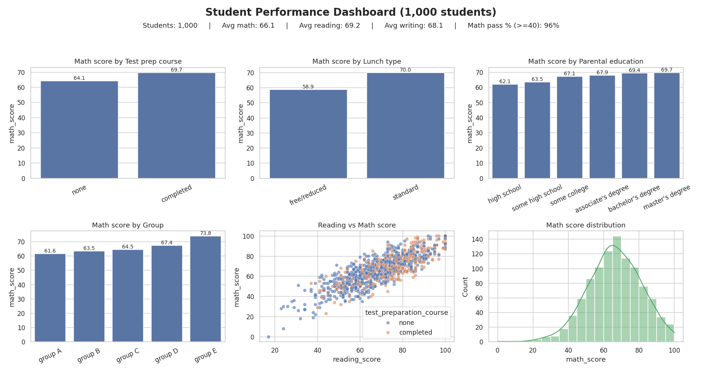
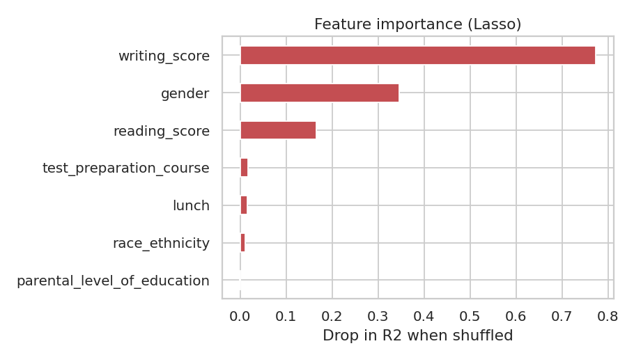

# 🎓 Student Performance Predictor

A data analysis and machine learning project that explores what influences students' **math scores** and predicts them from background and academic factors. It includes EDA, SQL analysis, model comparison, and a web app (Flask / Streamlit).

## Problem Statement
Schools want to identify students who may struggle in mathematics early enough to help them. This project answers two questions:
1. **Which factors are linked to higher or lower math scores?** (analysis)
2. **Can we predict a student's math score from their profile?** (machine learning)

## Dataset
`notebook/data/stud.csv`: 1,000 students, 8 columns, no missing values, no duplicates.

| Column | Type | Description |
|---|---|---|
| gender | categorical | male / female |
| race_ethnicity | categorical | group A to E |
| parental_level_of_education | categorical | high school to master's degree |
| lunch | categorical | standard / free-reduced |
| test_preparation_course | categorical | completed / none |
| reading_score, writing_score | numeric | 0 to 100 |
| **math_score** | numeric (target) | 0 to 100 |

## Tools Used
Python, Pandas, NumPy, Matplotlib, Seaborn, Scikit-learn, SQL (SQLite-compatible), Flask, Streamlit, Docker, AWS Elastic Beanstalk config.

## Dashboard


## Key Insights
1. **Test prep helps:** students who completed the course average **69.7** in math vs **64.1** without it (+5.6 points).
2. **Lunch type shows the biggest gap:** standard lunch **70.0** vs free/reduced **58.9** (11.1 points). Lunch is likely a proxy for family income, so this points to socio-economic support, not to lunch itself.
3. **Parental education matters:** students whose parents have a bachelor's or master's degree score about 7 points higher (69.4 to 69.7) than those whose parents finished only high school (62.1).
4. **Combined effect:** standard lunch + test prep = **73.5**, while free/reduced lunch + no test prep = **56.5**, a 17-point gap.
5. **Gender gap is subject-dependent:** males lead in math (68.7 vs 63.6), while females lead in reading (72.6 vs 65.5) and writing (72.5 vs 63.3).
6. **Scores are strongly linked:** reading and writing correlate at 0.95; math correlates 0.82 with reading and 0.80 with writing.
7. **At-risk group:** 40 students (4.0%) scored below 40 in math. 34 of them (85%) had *not* taken the test prep course, and 33 of them (83%) were on free/reduced lunch. *(The 40-mark pass cutoff is an assumption used for this analysis.)*

## Model Comparison
Trained on 80% of the data, evaluated on the 20% test split (`random_state=42`).

| Model | R² | MAE | RMSE |
|---|---|---|---|
| **Lasso** | **0.8816** | 4.15 | 5.37 |
| Ridge | 0.8806 | 4.21 | 5.39 |
| Linear Regression | 0.8804 | 4.21 | 5.39 |
| Gradient Boosting | 0.8722 | 4.30 | 5.58 |
| Random Forest | 0.8504 | 4.70 | 6.03 |

**Takeaway:** simple linear models beat the tree-based models. The relationship between scores is mostly linear, so a more complex model adds nothing here. The model predicts math score within about **±4 marks** on average.

### Feature Importance


`writing_score` is the strongest predictor, followed by `gender` and `reading_score`. Reading and writing are 0.95 correlated, so the model shares their importance unevenly. Do not read this as "writing matters 5x more than reading."

## SQL Analysis
9 queries in [`sql/queries.sql`](sql/queries.sql): KPIs, test-prep effect, lunch type, parental education, gender gap, top students, at-risk students and combined-factor analysis.

## Project Structure
```
├── analysis/            # EDA + model comparison script and result CSVs
├── artifacts/           # train/test data, trained model, preprocessor
├── images/              # charts and dashboard
├── notebook/            # EDA notebook and raw dataset
├── sql/                 # SQL queries
├── src/                 # ingestion, transformation, training, prediction pipeline
├── templates/           # HTML pages for the Flask app
├── app.py               # Flask web app
├── streamlit_app.py     # Streamlit web app
├── Dockerfile
└── requirements.txt
```

## How to Run
```bash
pip install -r requirements.txt
python src/components/model_trainer.py      # train the pipeline
python analysis/eda_and_models.py           # regenerate charts and model comparison
python app.py                               # Flask app
streamlit run streamlit_app.py              # or the Streamlit app
```
(The analysis script also needs `matplotlib` and `seaborn`.)

## Limitations
- Only 1,000 rows, so results may not generalise.
- Findings show **association, not causation**.
- No test-prep timing or attendance data.

## Credits
Original project structure by Nakul Singh. EDA insights, SQL analysis, model comparison, dashboard and documentation by Komal.
